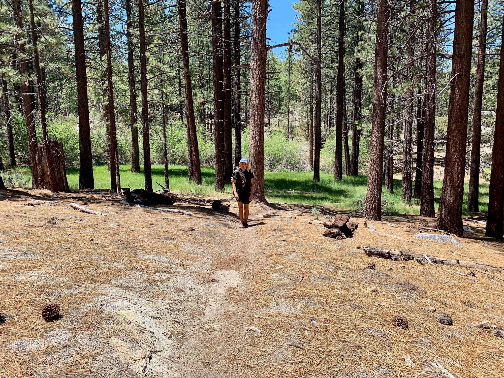

# Day Thirty-Four

Fortunately sleep was good. Perhaps too good. Slept in till 8 and was the last person to leave the area who had camped around me. Oh well, it’s probably for the best after a sleepless night.

After packing up camp I left the saddle to begin the climb up the opposing side as had been walked yesterday. The pines continued to increase in density, and the cool morning air was brisk.

<!-- more -->

A few miles later a super lush canyon in the distance revealed a stream with great flow, the first such one in many many miles. The climb continued and several others came and went. Such a refresher!

After passing a few I noticed a rock with the perfect incline adjacent a small pool of water in the stream. Stopped and did some foot maintenance and dipped my toes in. Freezing!

Static Stopped by and I asked him about his name. He did the entire PCT in 2015 and carried an am radio with him. He’d walk by people and it’s sometimes just be static. Amazing.

After the brief Siesta the climb begin to flatten out as I reached a plateau. The pines returned to chaparral. This was a difficult transition with the sun still high overhead.

During the hot downhill section coming off the mountain I felt somewhat mentally drained. The pine trees symbolizes a transition into the next section of the trail, yet I found myself back down in the expansive desert. To keep me going I listed to an episode of The Brain Science Podcast about aging well. After 45 minutes the guest went on to say, “honestly the  best thing for against thing is walking.” Got a good laugh out of me.

After the relentless downhill I arrived at a critical water cache. Perhaps 30 jugs containing 5 gallons of water each. In the process of filtering I had become distracted, and forgot my trekking pole when leaving. I had to backtrack maybe 150 yards to get it. Not a long distance, but a sign of my increasing mental exhaustion.

Perhaps it was just my headspace, but this is the most desert-like part of the entire trail. Super dry. Incredibly desolate. It reached 104 degrees in this valley today, and it was still remarkably hot.

I was surprised to have not seen anyone during the next few miles, as usually late in the day you’ll pass people setting up camp.

I kept pushing on to see if I’d run into anyone, and noticed some cow pies on the ground, a feature of the past hundred miles. I thought about how odd it was I hadn’t seen any cattle.

No sooner did I note that did maybe 15 cows appear ahead of me directly on trail. They all turned to look as I rounded the corner. I had to go off trail to go around them, ironically enough following cow trails through the brush.

Over the next few miles I still didn’t come across anyone, and at this point there are no man-made features around, other than the trail.

I began to feel super isolated, and my mental state quickly began to decline as I questioned what exactly I’m doing wandering through the desert for.

I push to another marked campsite and sure enough, no one was there. At this point it was almost entirely dark.

I noticed a report on the campsite that there is cell service at the top of the hill, so I keep pushing and notice a few  additional dispersed campsites, however the coverage is somewhat poor and it’s very windy on the ridge.

I make camp and try placing a call simply to have some interaction, but reception is very spotty and the call keeps dropping. I go to bed rather demoralized and exhausted.