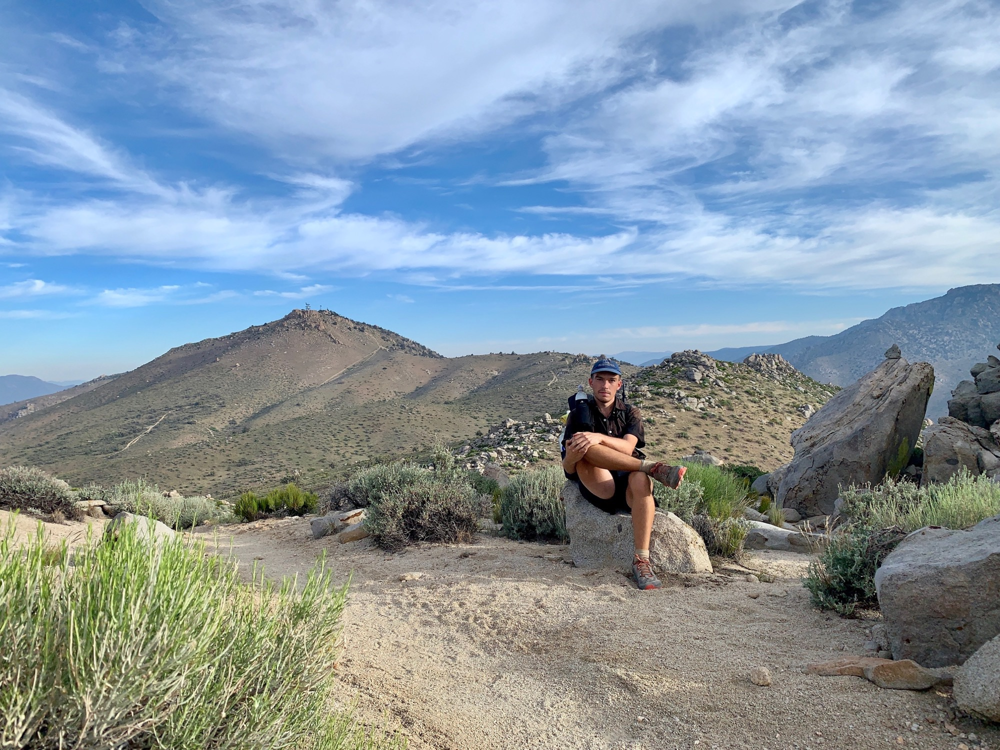

# Day Thirty-Five

I woke up with the sunrise, around 4:45am, packed up, and got going, eager to leave yesterday’s frustrations in the sand behind me.

A few miles after leaving camp the trail begins rapidly switchbacking upwards through an ultra-dry section. As there is no naturally occurring water for roughly 40 miles after this a number of volunteers have maintained a water cache for some years. When I arrived there was a single 5-gallon jug of water, and around 40 empties piled together.

<!-- more -->

Because of the shortage, and knowing how many others must be behind me, I took a modest amount. Just as I was about to leave a cloud of dust began rising in the distance. A truck pulled up  full of water jugs. It’s great to put a face to a volunteer; this one’s name is Devil Fish.

He explained the Pacific Crest Trail Association doesn’t like volunteers managing caches, which is understandable as they may simply go unmaintained when people depend upon them, however more extreme dry stretches like this would be almost impossible as most do not have the capacity to carry such an above average amount of water. He follows the trail moving north over the summer doing similar volunteering along the way.

I began the climb and the heat was particularly harsh throughout the switchbacks, but the effort was rewarded by a great view of the distant snow covered Sierra, a white blip on the horizon, although a slightly larger blip than the first view going into Tehachapi.

A meandering descent leads to some welcome shade by way of pines, and I break for lunch. While eating I notice substantial buildups I’ve cumuli-nimbus clouds to the north. They aren’t moving my way, fortunately, but it shows the blue skies don’t last forever.

I walk across a plateau where the trail flattens out and walk some fire roads. There’s been no one around since the water cache this morning, it’s hot, and the doubt from yesterday begins creeping back.

I’m aiming for Walker Pass, where section hikers doing the desert or the Sierra will generally begin and end their section hike. Considering the landmark, and my demeanor, the possibility of ending the hike here and picking it up at some other point sounds increasingly appealing.

The last few days the walk has felt more like a meander, and the desert has worn me out. Doing it solo makes me question to what degree it’s a selfish thing, and the thought of sharing it with someone else helps ease that guilt. 

Of course, listening to a Stanford lecture series on the biology of human social behavior might not be the best for walking the desert alone.

I have enough food to push for Kennedy Meadows (south), only two days away, but my mind is telling me to take at least tomorrow afternoon to pause and consider the options.

I reach the campground at Walker Pass and a car is idling, another hiker jumps out. He asks what my plan is, and I say maybe a night in town. The driver offers to take me to Kernville, a 40 minute hitch. I impulsively say sure, let’s go for it, and off we go.

He was born and raised in Onyx, a small town along the Kern River, and worked for 35 years under the Forest Service marking tree sales and topographic mapping. We arrive in town and I offer to buy him a beer for the ride, so we stop by the Kern Brewery for a drink. Interactions like this are such an enjoyable part of the trail. True serendipity. I’m already feeling better after a beer and some banter.

It’s late and I have no accommodations sorted. Next door is the, where I got a great room with a hiker discount. I’m feeling encouraged, but still unsure about what comes next.
