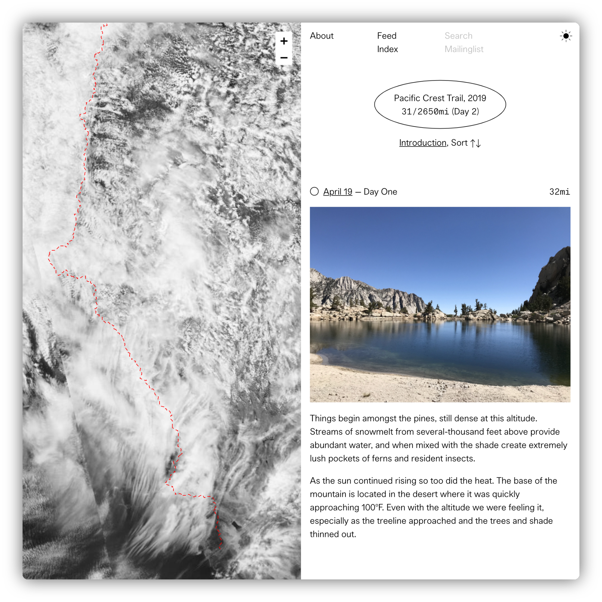

# Pacific Crest Trail, 2019

I’m going on a walk of the Pacific Crest Trail, a 2650mi path beginning at the Mexican border and ending at the Canadian border and running through California, Oregon, and Washington.

Along the way I’ll be logging brief entries, which can be viewed on [this dedicated page](/pct) created for friends and family to track progress.

<!-- more -->

There is no specific reason for the walk, or particular insight I’m looking to gain, but I do like to walk, and the timing lined up. Of course there are topics on my mind which is present in some of my recent work, and I’ll carry those ideas with me along the way.

In doing research for the trip I’ve seen so much imagery, and much of it is the same. While wanting to document my walk for myself, I have no interest in sharing it with an “audience.” This page simply formats notes I’m making for myself and nothing more. I plan for most days to be limited to a single photo and paragraph. There are plenty of people continuously photographing and filming the trail if that’s what you’re looking for.

The map updates live each day with fresh aerial imagery from the [VIIRS](https://ncc.nesdis.noaa.gov/VIIRS/) satellite, displaying the current snowpack and weather. Zooming in far enough switches to a shaded relief tile. Markers are positioned to indicate the campsites for each day, the most recent being filled. The path is marked by a single dashed line. There are no borders or other points of reference to identify position or scale.

Although there is an entry for each day, they will be uploaded in batches while when in town to resupply, somewhere between ever 4–5 days.

If you’re appreciative of the effort, feel free to buy me a drink or coffee for when I’m in town, either via Venmo (jondashkyle) or Cash ($jondashkyle).

Cheers!
