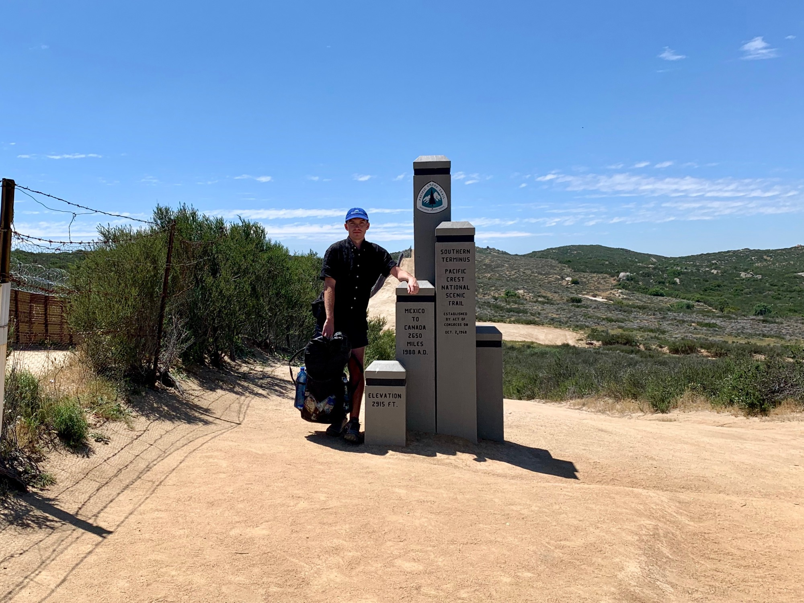

# The Pacific Crest Trail

Over four months during the summer of 2019 I hiked from the border of Mexico and California to the border of Washington and Canada, a total of 2650 miles along the [Pacific Crest Trail](https://en.wikipedia.org/wiki/Pacific_Crest_Trail). The PCT follows the backbone of three mountain ranges; the Transverse, the Sierra, and the Cascades.

<!-- more -->

It wasn’t so much a decision to give it a go, but more a mild obsession. Living in Los Angeles for several years, the San Gabriel mountains framing the city to the north have often been a weekend escape. The PCT actually runs through it, so I had been somewhat familiar, but there was no impulse until after a soft-relocation to New York in the spring of 2017 when I found myself following several hikers who had just started the PCT. It was my vicarious time in the mountains during a dry spell.

After returning to Los Angeles the timing fell into place. There is a narrow window to begin the hike. Too early and you run into too much snow in the Sierra. Too late and you’re getting snow up in Washington. The sweet spot is April, and I was lucky enough to secure a permit for April 19th. So you drive to the desert, stand next to the border of Mexico, and start walking.

I completed the trail on September 20th, walking continuously northbound and connecting (minus maybe one or two) all of my steps. I’m still processing, and will likely continue to for some time. It was life changing.

If there was a single motif throughout the walk, it was time. There was a lot of time to think about time. Repetition. Duration. I’m looking forward to applying some of what was on my mind to projects; some new, some old. All in time.