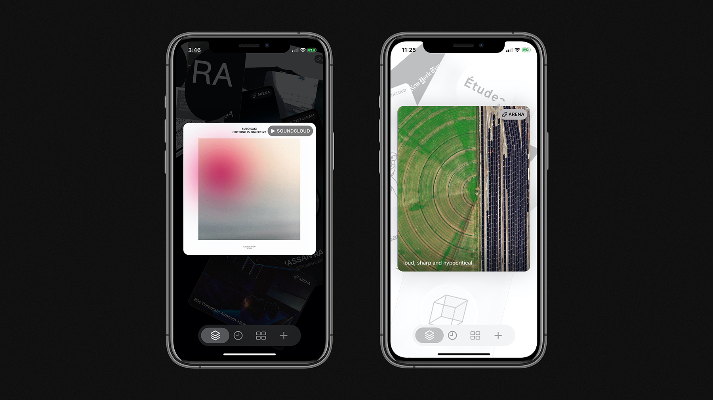

# Kawara

Within the range of rambles, this is of moderate length, expanding on my last few years and speculating on the next. The back button might be the way to go here.

When describing my time on the Pacific Crest Trail, I often say the defining motif was just how much time there was to think about time. After reaching the halfway point the trail flattened out. The most physically challenging sections were behind me. The difficulty ahead involved staying motivated in such homogeneous terrain.

During that period the question of “what next” began surfacing. Usually after lunch. I’ve been fortunate, in that there has never been any shortage of possibility when asking the question. These new circumstances were personally unique, though, as changes have felt gradual, whereas the amount of repetition in walking everyday, all day, for four months punctuated by a relatively drastic full stop.

One project I found myself returning to while considering all this was [Hardly Everything](https://hardlyeverything.com). The first iteration I built around five years ago, and each year or two I revisit the functionality and interface.

<!-- more -->

The project addresses two primary problems I experience, which are continually rephrased:

1. I’m constantly saving and organizing an exponentially growing collection of media. Image. Text. Video. Sound. There is always the intention of using this for reference, or to revisit it later, but the majority sits stagnant, displaced by the constant consumption of something new. No structural organization, like tagging, or folders, has ever improved on the issue. *I want a way of being infrequently reminded of things.*  

2. Today, many things I come across are by way of, for lack of better words, social media. Usually a feed. In order not to forget someone, or something, I’ll give it a follow. Unfortunately this opens up many simultaneous direct connections to all sorts of things I likely do not need a constant connection to. This creates the habit of always checking to see if there is something new. Not only that, what I see is determined by the platform in control of the feed. The non-linearity of feeds these days, an attempt at solving the issue of volume, means some things go unseen which may be of importance, but perhaps don’t generate the type of engagement these platforms prefer to see. *I want a way of controlling the rate of flow for the media I consume.*

I picked up drums at a young age, my parents both being musicians. In a very simple way, I think this cultivated a sensitivity to time. Rhythm, cadence, repetition, duration, tempo… Timing is everything. Later in life I found myself designing interfaces. Considering time as a primary component of interface design—something often understood spatially—is an endlessly fascinating area of inquiry, and I believe it will become increasingly important as time passes.

Hardly Everything is a webapp. It lives in the browser. There are a number of concerning practices today concerning data ownership and archival. As means of critiquing the status quo the app stores data in your browser. This means you own your data, but also limits your ability to access it elsewhere. It feels broken.

Last year I added support for the [Dat protocol](https://dat.foundation), which enables peer-to-peer distribution of static files, and projects like [Beaker Browser](https://beakerbrowser.com) use publishing and accessing websites. The set of questions their work engages are critically important.

I’m always glad to hear people find Hardly Everything useful, despite the idiosyncrasies. The project has always had a dual existence; one as functional app, and the other as somewhat of an app-as-essay on the state of the web. In the future, I’d like to emphasize the utility and accessibility at the expense of a few key compromises.

Firstly, it has to feel good. Unfortunately, no matter how much time you spend in browsers, apps never feels as good as those native. It’s called the *Document* Object Model for a reason, and almost anything pushing too hard against simply being a document will run into difficulty. Sometimes projects can transcend this, like in the case of Google Maps or Google Earth… which is to say it also helps have limitless engineering talent and huge stakes in defining the specs in a substative way.

On the other hand, companies like Apple have invested heavily in making native a first-class experience for the user. The developer tools have come an *extremely* long way recently, too. [SwiftUI](https://developer.apple.com/xcode/swiftui/) will feel familiar to anyone from React or Vue with it’s ELM-ish architecture. The big difference? You don’t get any of the messiness of the JS ecosystem (NPM, CLI build tools, etc…) or the browser (DOM strangeness, cross-browser BS…)

There are a few critical tradeoffs, like publishing through the App Store, but to anyone observing the recent trajectory of big platforms should not be surprised to see an increase in future regulation. Gatekeepers of some form will be necessary at scale. Hopefully this is the role of government and democratic process, not private corporations. It’s somewhat ridiculous to consider the requirement to licenses barbers, let alone architects, but not developers and designers of platforms with such societal influence.

I feel similarly with data ownership. The problems we encounter today will not be resolved through technical implementation, but slowly improved through regulation. I’m very optimistic about what this could look like—taking the power to make massive decisions away from private interest, and instead handing that to the users—the people. Of course at the scale of nation states it is a very slow moving process.

The current version of Hardly Everything will continue to function in perpetuity, and will the last update. The fundamental concept will continue on in my next project: [*Kawara*](http://kawara.app).

Kawara will be there to help you remember what’s important, and relieve you of what’s not. It will help you cultivate healthier habits in your use of social media. Don’t delete your account; just use it more wisely. It will be there when you want, and fade away when you don’t.

Kawara will be a native iOS app with a high level of integration, enabling both importing media from any source, and easily viewing that media in situ. That means looking at Instagram profiles *in* Instagram, for example, not some crippled web version. Like Hardly Everything, Kawara updates once a day. It does not demand your attention, so sometimes you can forget to check in. A daily personalized reminder via push notification helps ease you into a more natural circadian rhythm.

A private beta will begin in January, followed by a release sometime in the first quarter of 2020. If you’d like to gain early access [subscribe to updates](https://www.kawara.app).