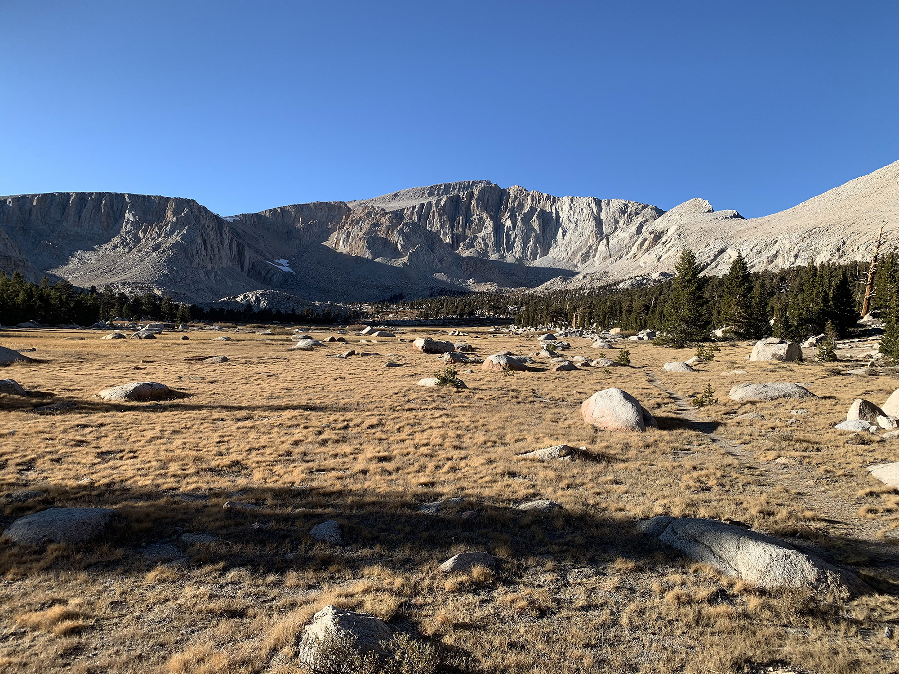

# Mount Langley

Looking back on the PCT after completing it last summer, the Sierra stood out as my favorite part. Without a doubt. Prior to leaving it felt like a decent trip—around four hours from home in Los Angeles. After walking to Canada over four months it felt practically in my backyard.

After only being home for maybe a week, the weather window in the Sierra was still holding, but only for a few more days. One other hiker I ran into in Oregon, Monk, lives only a few miles away, and we had planned to sync up on a few trips in the future.

<!-- more -->

Seeing the imminent snow signaling the start of winter, and the end of summer hiking conditions, I couldn’t help but ask if he wanted to run up to the Eastern Sierra for a quick weekend trip.

By the end of the PCT I was a little worn out on following a trail all day every day. I’d intentionally go off trail just to keep it fresh. Doing some extended off-trail route finding next summer has me excited. I came up with a route by looking at shaded relief maps in Caltopo to get a sense of elevation change, and zooming around the Sierra in Google Earth.

I settled on a simple route starting at Crabtree Meadow trailhead. When needing to resupply on food when entering the Sierra I exited to Lone Pine from here. We’d follow a trail up to Cottonwood Lakes, go up and over Old Army pass the next morning, then go off trail and summit Mount Langley at 14026ft.

From there we’d head back down to Old Army Pass, but instead of descending continue up towards Cirque Peak, zip around to Chicken Spring Lake, and link back up to the trail back near Crabtree. The [total route](https://caltopo.com/m/87G9) is about miles. After weeks of hitting 30–40 a day on the PCT this seemed like nothing. Of course the elevation would factor in here.

