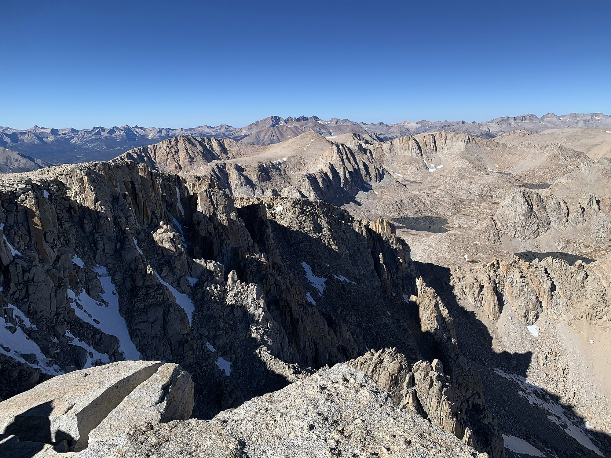

# Mount Langley

Looking back on the PCT after completing it last summer, the Sierra stood out as my favorite part. Without a doubt. Prior to leaving it felt like a decent trip to get out there—around four hours from home in Los Angeles to Lone Pine. After walking to Canada over four months it felt practically in my backyard.

After only being home for maybe a week, the weather window in the Sierra was still holding, but only for a few more days. One other hiker I ran into in Oregon, Monk, lives only a few miles away, and we had planned to sync up on a few trips in the future.

<!-- more -->

Seeing the imminent snow signaling the start of winter, and the end of summer hiking conditions, I couldn’t help but ask if he wanted to run up to the Eastern Sierra for a quick weekend trip.

By the end of the PCT I was a little worn out on following a trail all day every day. I’d intentionally go off trail just to keep it fresh. Doing some extended off-trail route finding next summer has me excited. I came up with a route by looking at shaded relief maps in Caltopo to get a sense of elevation change, and zooming around the Sierra in Google Earth.

I settled on a simple route starting at Crabtree Meadow trailhead. When needing to resupply on food when entering the Sierra I exited to Lone Pine from here. We’d follow a trail up to Cottonwood Lakes, go up and over Old Army pass the next morning, then go off trail and summit Mount Langley at 14026ft.

From there we’d head back down to Old Army Pass, but instead of descending continue up towards Cirque Peak, zip around to Chicken Spring Lake, and link back up to the trail back near Crabtree. The [total route](https://caltopo.com/m/87G9) is about 20 miles. After weeks of hitting 30–40 a day on the PCT this seemed like nothing. Of course the elevation would factor in here.

We drove out, and in no time had reached the trailhead, grabbed our packs, and got moving. It was around 3pm, and it was only 6 miles until camp. Can’t express how good it felt to be back out here. Was surreal passing the sign indicating the threshold of the John Muir Wilderness. Passing this while on the PCT was such a big moment.

Eventually the trail opens up to a massive alpine meadow dotted by a series of lakes. In the distance looms Langley. I was surprised by how different it felt at this time of year. The muted colors.

While on the PCT you’re so focused on doing miles each day. Taking break usually centered around food or sleep. My legs were still in this mode while heading towards camp this evening, and I had to remind myself to take it easy.

After reaching Cottonwood Lake Number Five (yeah, really) we looked around for a nice flat area around the big granite erratics blanketing the area. We both decided to cowboy camp without our tents since it was such a nice evening. I mentioned relenting the bear cans we had to bring for only one night of food. An extra 2.2lbs. Monk mentioned a story he heard on the PCT of someone’s bear can getting jammed shut somehow.

We broke into the food we brought with us, and wouldn’t you know it—Monk’s bear can was jammed shut, and he wasn’t able to get it open no matter what!

As the sun dipped the temperature quickly dropped. I climbed into my quilt and didn’t have much luck dozing off. I never do when I cowboy under stars. Same reason I can’t fall asleep on airplanes. My head can’t shake just how remarkable the circumstances are.

Eventually I dozed off and got a few hours of sleep. It was pretty chilly. Before long I briefly opened my eyes and the first bit of sunlight began illuminating the pass we were about to head up.

We got going after a quick snack. It was difficult to tell where the trail was from our vantage at camp, but as we approached it became more clear. Old Army Pass was replaced by New Army Pass (ha) due to the amount of snow which sticks around all year. It’s been unmaintained for some time, and there was a little scramble or two.

I was feeling good, but while heading up the pass noticed how quickly you begin to lose your trail legs after only a few weeks. After posting up on a nice ledge at the top of the pass Monk also crossed over. Our plan was now to head up Langley, another three miles and a healthy 2k of elevation gain.

Monk came over and mentioned not feeling too great. His hip was bothering him, and we were both feeling the elevation a bit. He decided to hang back at the pass while I went off to summit.

After a few miles of off trail scrambling, to make it a little more exciting, I reached the summit. I’m not very motivated by reaching summits, but it’s a good excuse to do a trip like this. I hung around for maybe 15 minutes, then began to head back down. All of it was down scree, and you could almost boot-ski down it.

I made it down to Old Army Pass where Monk was posted. We decided to forgo the off trail route because of the hip troubles, and opted to head down New Army Pass to create a little loop. Definitely wanting to spend more time out in this area during the upcoming summer.

We made it back to the car around 4pm, and drove back down to Lone Pine where we grabbed milk shakes. Food tastes so good after even just a day out there. The drive down the 395 back to Los Angeles never gets old. The lights on the horizon at night are like a mirage. Somehow this place exists.

Later in the afternoon the next day Monk sent me a text. “I was turning the lid on the bear can the wrong way.”