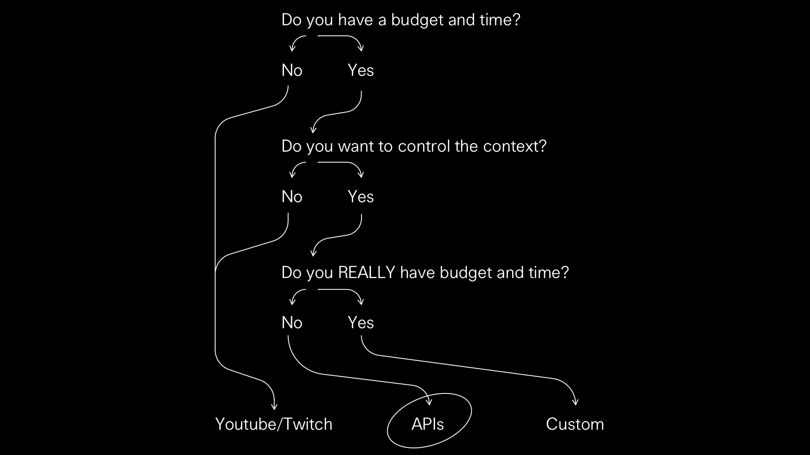

# Ways of Going Live

[Ways of Going Live](http://jondashkyle.s3.amazonaws.com/2020-04/ways-of-going-live.mp4)

Measures to mitigate the spread of Coronavirus have created a number of headaches for public gatherings. Simple things like small group hangs, to entire seasons of programming at cultural institutions now on hold.

*Times are a little weird.*

I’ve received a series of questions about creating custom live streams, leading to a collection of research and a fair amount of experience. I want to share this with anyone who may have similar questions. Instead of being a comprehensive overview, this is related to the needs of those inquiring projects, and my own idiosyncrasies. It’s concise, but if you have questions, [send a quick note](mailto:contact@jon-kyle.com).

<!-- more -→

A custom livestream may be useful if:

- You have a built-in audience and want to control the context and environment of the stream beyond what is possible with big streaming platforms.  

- You are a museum, or other cultural venue, looking to transition some upcoming programming online.  

- You want to include appropriately licensed material in your stream which may receive an automated copyright strike through a streaming platform.  

- You want to eliminate third party ads displayed within or in proximity to your stream.

## Solutions

We’re focusing on three possible solutions, each representing varying levels of cost, control, and time.

- *Existing Platforms*, like [Youtube](https://youtube.com) and [Twitch](https://twitch.com)
- *API Services*, like [Vimeo](https://vimeo.com) or [Mux](https://mux.com)
- *Fully Custom*, using a custom streaming server

Note that this will not focus on experimental solutions, but proven infrastructure with minimal resources.

### Existing Platforms

While the familiar names in live streaming are the simplest way to go live, there are a few limitations if full control over functionality and design is needed.

When embedding a livestream in a page it [is possible to hide or replace](https://videojs.com) the platform’s controls, but other elements like the platform’s logo, lower-third ads and recommended videos cannot be disabled. It’s also not possible to customize the design of the chat, if there is an option for embedding.

Automatic copyright strikes are also a frequent problem, regardless of pre-arranged licensing. I’ve come across a number of streams by musicians playing their own music which have been automatically removed.

Instagram *officially* does not have an API for streaming outside of their app, but there are a few [private APIs](https://github.com/dilame/instagram-private-api) floating around that make it possible. I’ve had limited success with this, and have a hunch Instagram keeps track of requests not matching a certain shape to disable them after so many times.

Of course, much of this also comes down to vibe. Does your stream feel good living inside of Youtube? Or does it want to have a place of its own?

### API Services

The most useful feature of the big platforms is how they remove any concern over hosting and servers. API services do too, but provide the tools for totally determining your own functionality and interface.

These services provide an endpoint, which you can send a request to for creating a livestream. This returns a key which can be used in streaming software like [OBS](https://obsproject.com). After the livestream ends the video is then transcoded and hosted.

This comes at a price, and also doesn’t *entirely* eliminate servers, as you must authenticate requests to the API—but the savings are substantial when compared with the resources necessary for a fully custom solution, and greatly reduces the operational overhead and general complexity.

### Fully Custom

For the most demanding circumstances, a fully custom solution may be appropriate. This involves configuring the hosting environment and getting familiar with [RTMP](https://en.wikipedia.org/wiki/Real-Time_Messaging_Protocol). I had success with the [NGINX module](https://github.com/arut/nginx-rtmp-module), and there is a [Docker image](https://hub.docker.com/r/tiangolo/nginx-rtmp/) available.

Getting running is one thing. Ensuring continuous uptime and scaling introduces an additional set of involved concerns. I can’t imagine a situation requiring this level of granular control without having someone dedicated (at least part time) to these considerations.

## My Take

My process is likely similar to you, if you happen to be reading this. I want to fully control the design and functionality. This means platforms are not a viable option. Likewise, I’m not interested in maintaining servers or intense system architecture.

Out of the possible solutions, this leaves API services remaining. I passed a couple afternoon really digging through the options. Vimeo is too expensive and limited. Livestream is now Vimeo. There really isn’t much else out there, as it’s such a low margin market. But…

Fortunately there is [Mux](https://mux.com). Mux is the self described “Stripe of live streaming”, and I’d say this is accurate. As someone who is not interested in creating a payment solution, Stripe is my primary choice in payment processing. Likewise with Mux and streaming servers. It all comes down to a good API and documentation. Mux realizes this, and has provided just that.

Mux has a good guide on how to get started, including a [demo using Glitch](https://mux.com/articles/how-to-build-your-own-live-streaming-app-with-mux-video/). Because the server doesn’t store any media, it can be very modest in a pinch.

## Wrapping it Up

I hope this has been of some help! 