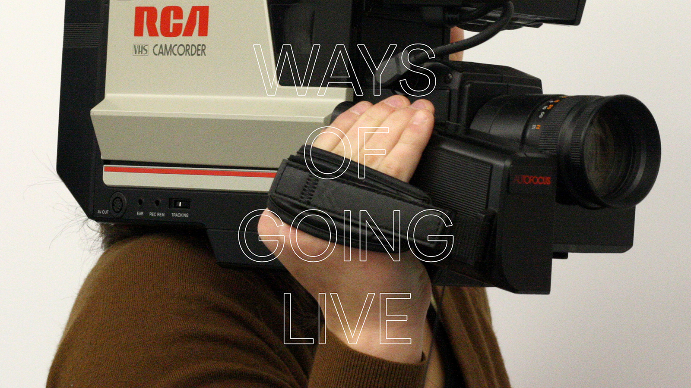

# Ways of Going Live

Times are a little weird.

Measures to mitigate the spread of Coronavirus, while clearly necessary, have created a number of headaches for public gatherings. Simple things like small groups hanging, to entire seasons of programming at cultural institutions now on hold.

In reaction to this, I’ve received a series of questions related to live streams across a range of applications, and generally centered around culture. This has led to accumulating a decent amount of research, and I’d like to share this with everyone who may be having a difficult time navigating the possibilities.

On April 21 at 10am PST I’ll be doing a livestream (appropriately) here on my personal site. The goal is accessibility, and to help inform those without deep technical knowledge. A few directions of ranging scale complexity, cost, and time will be covered.

There is a chance you will find this useful if:

- You have a built in audience and want to control the context and environment of the stream beyond what is possible with streaming platforms.
- You represent a museum, or other cultural venue, looking to transition some upcoming programming online.
- You want to include appropriately licensed material in your stream which may receive an automated copyright strike through a streaming platform.
- You do not want third party ads displayed within or in proximity to your stream.

If anyone has more technical questions, I’ll be glad to touch on them after the stream has been completed.