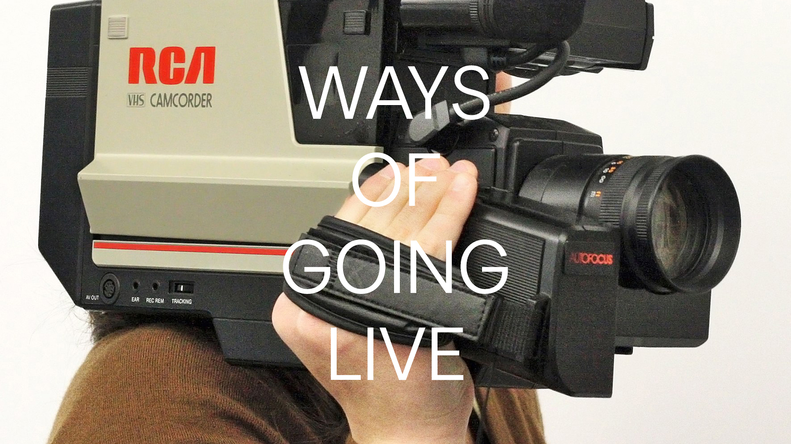

# Ways of Going Live

Measures to mitigate the spread of Coronavirus, while clearly necessary, have created a number of headaches for public gatherings. Simple things like small groups hanging, to entire seasons of programming at cultural institutions now on hold.

*Times are a little weird.*

In reaction to this, I’ve received a series of questions related to live streams across a range of applications, and generally centered around culture. This has led to accumulating a decent amount of research and experience. I’d like to share this with everyone who may be having a difficult time, or has questions about live streams.

On April 21st (Tuesday) at 10am PST I’ll be doing a livestream (appropriately) here on my personal site. We’ll start with the basics, and work up towards technical solutions, along with covering concerns of scaling, complexity, cost, and time.

This will be useful for those who do not program, and are looking for guidance on decision making and topics of discussion within a team. Some of this can be esoteric—the goal is to focus on what is understandable and create a working knowledge of how things fit together.

The second half of the stream will be a good primer on the state of live streaming for those who know some programming, but have yet to get in the weeds with RTMP, HLS, etc…

Consider tuning in if:

- You have a built-in audience and want to control the context and environment of the stream beyond what is possible with big streaming platforms.  

- You are a museum, or other cultural venue, looking to transition some upcoming programming online.  

- You want to include appropriately licensed material in your stream which may receive an automated copyright strike through a streaming platform.  

- You want to eliminate third party ads displayed within or in proximity to your stream.

If anyone has more technical questions, I’ll be glad to touch on them after the at the end of the stream. An overview article will be published a few days after the stream, along with an archive of the video.

Note that this will not focus on experimental solutions, but solid infrastructure with minimal resources.

Hope to see you there ✌️