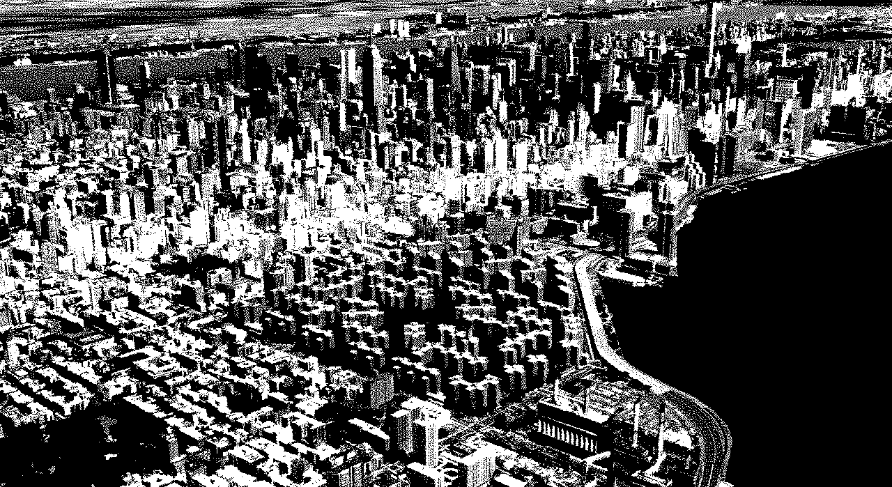
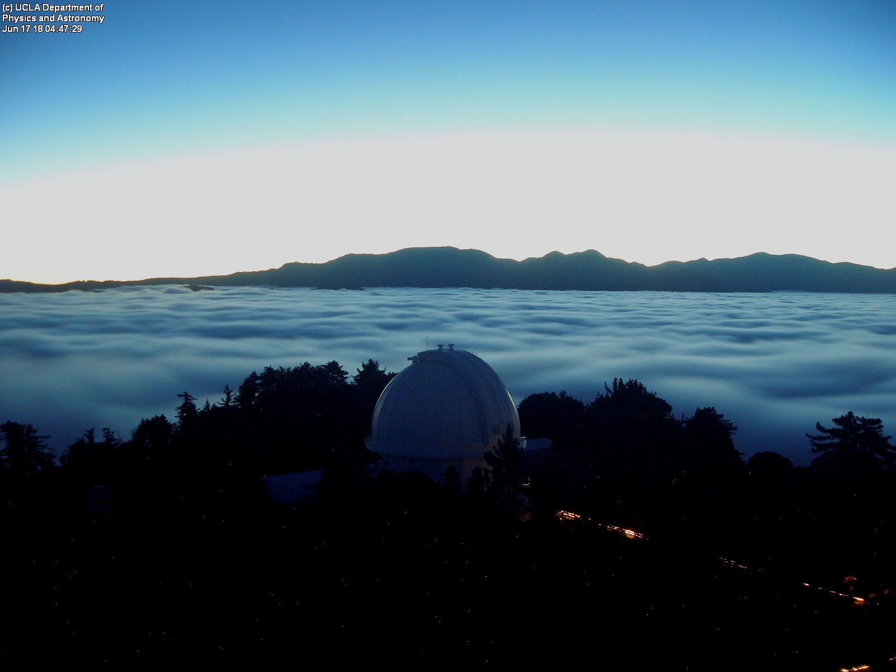

Hey there,

Hoping this finds you well. You’re receiving this because at one point you subscribed to my mailing list. There haven’t been any updates sent up until now; consider this the first!

If you’d like to [unsubscribe]({{UnsubscribeURL}}), no hard feelings. Perhaps instead you could add me to your Hardly Everything list and revisit at your own pace. Speaking of which…

## Hardly Everything 2.0

Hardly Everything is your feed with a cadence, and is used to follow things at your own pace. When following a link you prioritize it by defining a period of rest. After visiting the link it disappears for the duration you’ve chosen. Resurface what’s important to you, however fast or slow you like.

- Now distributed with Dat, so you can access your follows offline and own your data when visiting in [Beaker Browser](https://beakerbrowser.com).
- Removed Google Fonts for the best self-hosted open source type.
- Introduced the Blog, featuring contributed lists of links important enough to be remembered.

For additional context, take a look at the [related entry in the log](https://jon-kyle.com/entries/2018-06-14-hardly-following-anything).

## Trans-Catalina Trail

Back in April I hiked the 40-odd miles across Catalina Island off the coast of Los Angeles. Some anecdotes from the trail, tips, and photos [on the log](https://jon-kyle.com/entries/2018-05-26-trans-catalina).

## Peer-to-Peer Web / NYC

Video documentation of Peer-to-Peer Web / NYC is online. The sixth installment in the Peer-to-Peer Web series was organized by [New Computer Working Group](https://newcomputers.group/) and several participants shared how they related to the internet, network infrastructure, and distributed publishing. Shouout [Callil](https://newcomputers.group/), [Alejandro](http://www.matamala.info/), [Laurel](http://laurelschwulst.com/), [Hugh](http://lucid00.com/), and all others who organized!

## Tower Cam

I obsessively check the Mount Wilson Tower Cam, and made a page which archives the past 24 hours of stills into a scrubbable time lapse.

[tower-cam.jon-kyle.com](https://tower-cam.jon-kyle.com)

---

That’s about it in a nutshell :)

[Unsubscribe]({{UnsubscribeURL}})