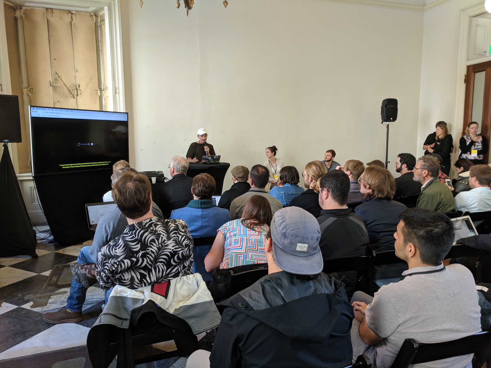
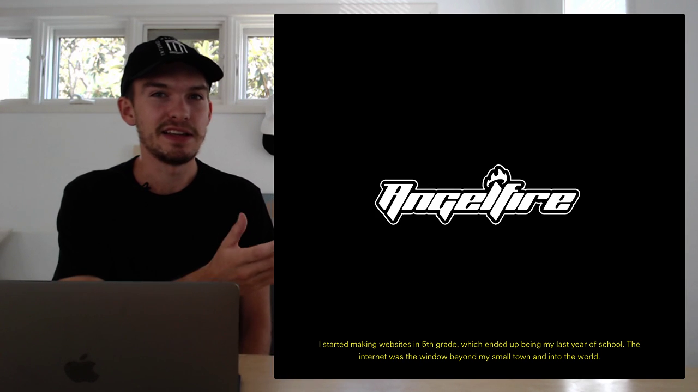

Hey there,

Another month, another update. Some travels and updates to familiar projects, mostly. A little live hang session, too. Overall, all is well!

## Decentralized Web Summit 2018

I attended the DWeb Summit at the [Internet Archive](https://internetarchive.org), a gathering of programmers, cryptographers, artists, and computing pioneers working on decentralizing the web. My focus was to write a [scene report for the Are.na Blog](https://www.are.na/blog/scene%20report/2018/08/13/decentralized-web-summit.html), and a quick talk about time and links for Dat’s session.

## Hang #5

As means of archiving my contributions to the Decentralized Web Summit I held a [quick post-hang session](https://jon-kyle.com/hangs/18-08-15-decentralized-web), during which I shared my talk and read aloud the Are.na scene report. Quick look at monopack, and riffing off some questions, too.

## Monopack

I’ve been searching for something like an oversized fanny pack, or super small duffle. Just a single volume. No pockets. Simple. Can be worn slung over a single shoulder or across the chest. Zipper down the full length for easy access. Ultralight technical fabrics. Basic, but impossible to find, so I [designed one and documented the process]((https://jon-kyle.com/entries/2018-07-30-mono-pack)) of making it.

## Hardly Everything

<figure></figure>

In addition to a few fresh lists of [links kindly contributed to the blog](https://hardlyeverything.com/blog), enhanced data ownership was introduced to the panel, making it easier than ever to [understand and manage your data](https://hardlyeverything.com/blog/020-dat).

---

Until next time! ✌️

[Unsubscribe]({{UnsubscribeURL}})