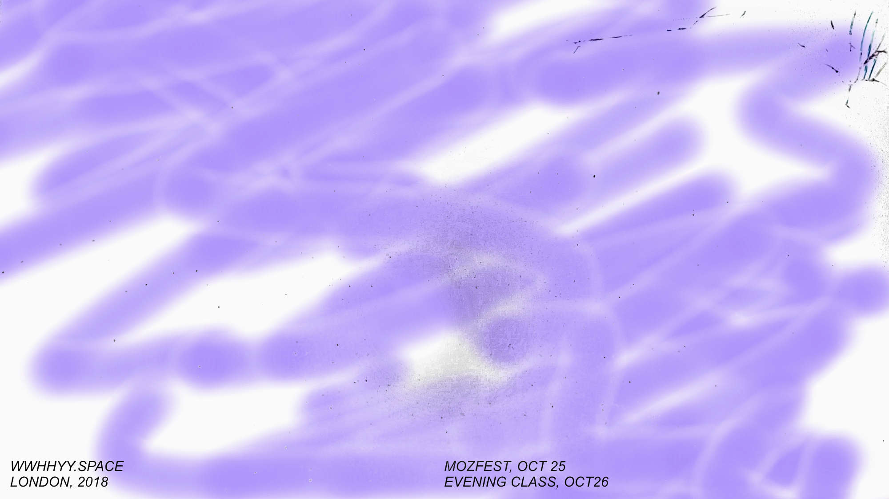
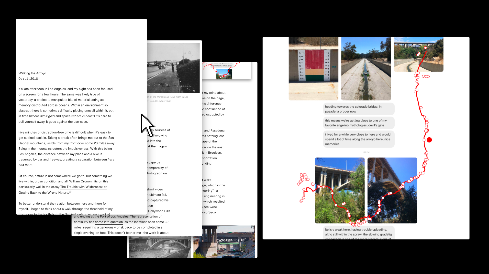

Hey there,

Happy autumn! All sorts of new things. Let’s get to it.

## Whyspace

In this time of solutionism, when there is a technological answer for everything, remember to ask questions. Whyspace is a new project, a non-place for questioning, and it’s taking me to London between October 22–29.

There will be a stop at [MozFest on the 24th](https://wwhhyy.space/events/18-10-24-mozfest), for those attending the conference, and [Evening Class on the 25th](https://wwhhyy.space/events/18-10-25-evening-class), open to the public. Both will be livestreamed at [wwhhyy.space](https://wwhhyy.space).

## Peer-to-Peer Web

It would be inaccurate to say Peer-to-Peer Web is winding down, it’s just time for new things. A year has passed since we began hosting a series of relaxed and informative hangouts for anyone interested in the evolving web.

We leave behind an archive containing hours of talks given by participants at hangouts in Los Angeles, New York City, and Berlin. They range in topic, but have in common a hopeful speculation of possible futures, online, offline, and that liminal space in between.

For more about this [head over to Peer-to-Peer Web](https://peer-to-peer-web.com/note), or tune into the livestream on October 18th.

## Arroyo Walk

Taking a break often brings me out to the San Gabriel mountains, visible from my front door some 20 miles away. With this being Los Angeles, the distance between my place and a hike is traversed by car and freeway, creating a separation between here and there. To better understand the relation I walked the length between the two, creating a sort of symbolic link them.

Take a look at [the walk itself](https://arroyo.jon-kyle.com), then head over to [the reflection essay](https://jon-kyle.com/entries/2018-10-01-walking-the-arroyo).

## Hang #6

Tomorrow I’ll be doing a brief livestream going over the changes to Peer-to-Peer Web, the introduction of Whyspace, and available to riff on questions. To join, just [navigate to the hangs](https://jon-kyle.com/hangs) around noon PST on the 18th, or catch it later once it’s archived.

---

[Unsubscribe]({{UnsubscribeURL}})