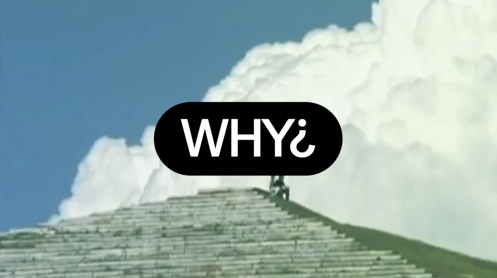

Hey there,

A little late, but happy fall for those in the northern hemisphere, and I suppose happy spring for all of those in the southern! A few happenings since last time.

## Why¿

Why¿ is a . In time things will become clearer, but for now, expect to ask what (essays, interviews, observations) and when (livestreams, workshops, relaxed events).

The first livestream, [*On Public Parks and Open Networks*](https://www.wwhhyy.space/entries/network-park), will take place on Monday December 10th at 10am PST.

## London Calling

[![london.jpeg])](https://jon-kyle.com/entries/2018-10-31-london-calling)

The first two Why¿ hangs were back in October in London. My friends from Code for Science and Society, who are behind the Dat protocol, invited me to lead a workshop at MozFest 2018. The following evening I stopped by [Evening Class](https://evening-class.org), which you should check out if unfamiliar, to provide an option for some of those unable to attend the conference.

[Read the recap](https://jon-kyle.com/entries/2018-10-31-london-calling) →

## Peer-to-Peer Web

It would be inaccurate to say Peer-to-Peer Web is winding down, it’s just time for new things. A year has passed since we began hosting a series of relaxed and informative hangouts for anyone interested in the evolving web.

We leave behind an archive containing hours of talks given by participants at hangouts in Los Angeles, New York City, and Berlin. They range in topic, but have in common a hopeful speculation of possible futures, online, offline, and that liminal space inbetween.

[Continue reading the note](https://peer-to-peer-web.com/note) →

---

Until next time! ✌️

[Unsubscribe]({{UnsubscribeURL}})