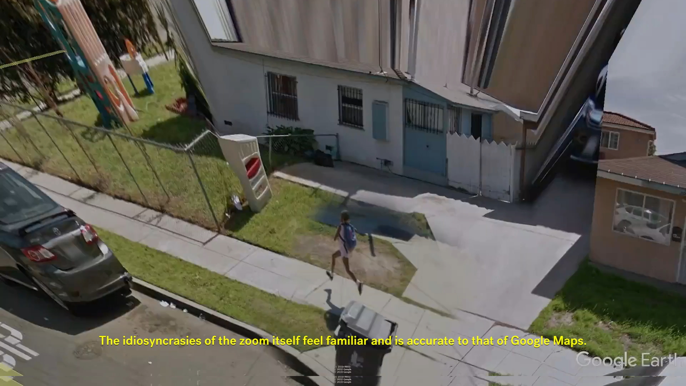

Hey there,

Happy new year! Here we are. 2k19. Shaping up to be a good one. Some recent happenings, some soon to happen.

## Why¿

I made a video, **Entangled Environments of Music Videos** looking at instances of the music video as a medium for technological speculation. 

When an artist today clicks upload, how does the work relate to the environment in which it’s made available? To attempt better understanding these familiar questions of art and environment in the context of today’s hyper-connectedness, I’ll be directing a workshop, , where we’ll “go to the desert” of the internet, a temporal zone available only as long as someone is present.

## Hardly Everything

To encourage some serendipity there is now a new feature: Entropy, for introducing a little chaos.  →

---

Until next time! ✌️

